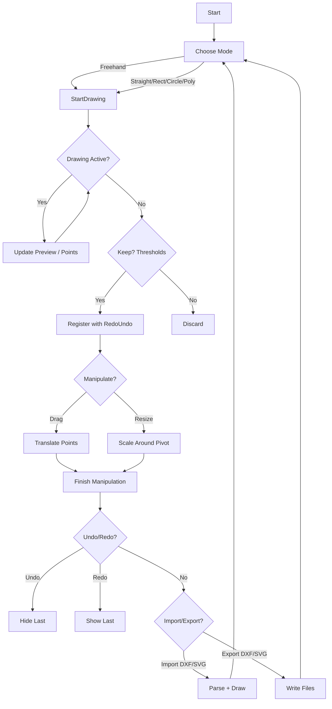

# Presentation Script — Liam

Role and topics
- Activity diagram (with Kyle)

Objectives (2–3 minutes)
- Visualize the user activity flow from tool selection through drawing, manipulation, and export.

Slide 1 — Activity Diagram (Mermaid)


Narration notes
- Emphasize thresholds: shapes are kept only if size/radius/length exceeds `minLineLength` or shape‑specific minimums.
- All manipulations operate in whiteboard local space to avoid drift.
- Undo/Redo are visual (activate/deactivate) via `RedoUndoManager`.

Hand‑off to Kyle
- Kyle will extend the activity perspective with Circle drawing and Export details, plus a demo snippet.

Code snippet (activity loop hook)
- Trigger‑driven drawing and Update path (from `Assets/Scripts/SplineVRDraw.cs`)
```csharp
void Update()
{
    if (rightController != null && rightController.inputDevice.isValid)
    {
        rightController.inputDevice.TryGetFeatureValue(CommonUsages.triggerButton, out bool triggerPressed);

        if (triggerPressed && !lastTriggerState && !isDrawing)
            StartDrawing();
        else if (!triggerPressed && lastTriggerState && isDrawing)
            StopDrawing();

        lastTriggerState = triggerPressed;
    }

    if (isDrawing || alwaysDraw)
        UpdateDrawing();
}
```
Explanation
- The activity loop transitions based on trigger edge detection. While active, `UpdateDrawing()` executes the selected mode’s preview/update.
