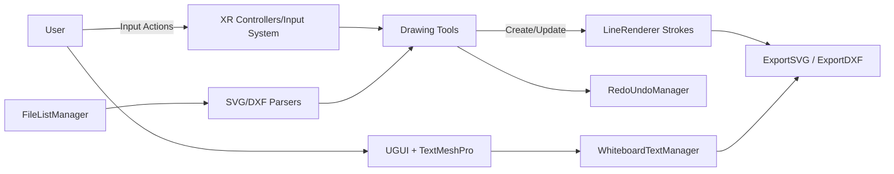

# Presentation Script — Lilize

Role and topics
- System flow
- Code discussions: Text, Import

Objectives (3–4 minutes)
- Present the system flow and UI integration.
- Explain text authoring/dragging and DXF/SVG import pipeline.

Slide 1 — System Flow (Mermaid)


Text features
- Files: `Assets/Scripts/TextManager.cs`, `Assets/Scripts/DraggableText.cs`
- Flow
  - Click “Add Text” → show TMP input → on submit, instantiate a TMP label under `whiteboardArea`.
  - Each label gets `DraggableText`, which clamps dragging to the whiteboard rect and supports controller‑based drag/resize on the whiteboard plane.
  - `textHistory` records content, position, and font size for export; labels are also registered with `RedoUndoManager` so undo/redo/clear apply to text.
- Inspector configuration
  - `openInputButton` (Button), `textInputField` (TMP_InputField), `whiteboardArea` (RectTransform), `textPrefab` (TextMeshProUGUI).
  - VR integration: assign `whiteboardPlane`, `drawingTip`, and `InputActionProperty` bindings for drag/resize/undo/redo to mirror drawing tools.
  - For world‑space canvas: ensure a `GraphicRaycaster` and an `EventSystem` with `InputSystemUIInputModule` exist.

Import — SVG/DXF
- Primary entry: `Assets/Scripts/FileListManager.cs`
  - Builds a file list UI from `Assets/<importFolderPath>`.
  - On click: detects extension and routes to `LoadSVGFile` or `LoadDXFFile`.
  - Parses into a sequence of drawing commands (MoveTo/LineTo/Circle, and ARC segmented), then renders to the whiteboard with a `LineRenderer` per path; groups are separated to avoid unintended connections.
- DXF (optional path): `Assets/Scripts/ModelingTools/Import/DXFImporter.cs` → `DXFPathRenderer` for interactive paths.
- Inspector configuration (FileListManager)
  - UI: `fileSelectionPanel`, `togglePanelButton`, `scrollViewContent`, `fileButtonPrefab`.
  - Whiteboard: `drawingPlane`, `lineRendererPrefab`, sizing (`whiteboardWidth/Height/Center`), `importedDrawingColor`, `importedDrawingZOffset`.
  - Behavior: `useSimplifiedParsing`, `showDXFAsPoints`, `logDXFContent`.
  - Visibility: imported strokes use a positive Z‑offset and material renderQueue bump so they sit on top of the board.

Export notes
- SVG export maps strokes to canvas coordinates and includes UGUI and world‑space TMP text.
- DXF export writes LWPOLYLINE vertices and, when enabled, TEXT entities sized by a configurable height factor.
- Editor uses `SaveFilePanel`; Windows standalone uses a native SaveFileDialog.

Demo cue
- Open file panel → select an SVG → show distinct paths rendered on the board; repeat with a DXF.
- Drag a text label and export to SVG to confirm position mapping.

Q&A prompts
- How do we avoid connecting unrelated segments on import? — We separate paths and honor MoveTo/LineTo groups.
- Why render on top? — We adjust material renderQueue and Z‑offset for imported drawings.

Code snippets (Text + Import)
- Add and record a text label (from `WhiteboardTextManager`)
```csharp
private void OnTextEntered(string newText)
{
    if (!string.IsNullOrWhiteSpace(newText))
    {
        TextMeshProUGUI newTextObj = Instantiate(textPrefab, whiteboardArea);
        newTextObj.text = newText;
        newTextObj.rectTransform.sizeDelta = new Vector2(50, 20);
        newTextObj.fontSize = 12;
        newTextObj.color = Color.black;
        newTextObj.rectTransform.anchoredPosition = Vector2.zero;
        newTextObj.raycastTarget = true;
        newTextObj.transform.SetAsLastSibling();

        DraggableText draggable = newTextObj.gameObject.AddComponent<DraggableText>();
        draggable.Initialize(whiteboardArea);

        textHistory.Add(new VectorTextEntry(
            newText,
            newTextObj.rectTransform.anchoredPosition,
            Mathf.RoundToInt(newTextObj.fontSize)
        ));
    }
    textInputField.text = string.Empty;
    textInputField.gameObject.SetActive(false);
}
```
Explanation
- New TMP text is instantiated under the whiteboard and made draggable; we record content/position/size for export.

- Clamp dragging inside whiteboard (from `DraggableText`)
```csharp
public void Initialize(RectTransform whiteboard)
{
    whiteboardRect = whiteboard;
}

// in Update
Vector2 whiteboardSize = whiteboardRect.rect.size;
Vector2 textSize = rectTransform.sizeDelta;
float minX = -whiteboardSize.x/2f + textSize.x/2f;
float maxX =  whiteboardSize.x/2f - textSize.x/2f;
float minY = -whiteboardSize.y/2f + textSize.y/2f;
float maxY =  whiteboardSize.y/2f - textSize.y/2f;
newPosition.x = Mathf.Clamp(newPosition.x, minX, maxX);
newPosition.y = Mathf.Clamp(newPosition.y, minY, maxY);
```
Explanation
- The draggable label’s anchored position is clamped so it cannot leave the whiteboard rectangle.

- Import route (from `FileListManager`)
```csharp
private void OnFileButtonClicked(string fileName, string fullFilePath)
{
    ClearCurrentDrawings();
    string ext = Path.GetExtension(fileName).ToLower();
    switch (ext)
    {
        case ".dxf": LoadDXFFile(fullFilePath); break;
        case ".svg": LoadSVGFile(fullFilePath); break;
    }
}
```
Explanation
- Button clicks dispatch to the proper loader. The SVG/DXF loaders parse into drawing commands and render to the board.
